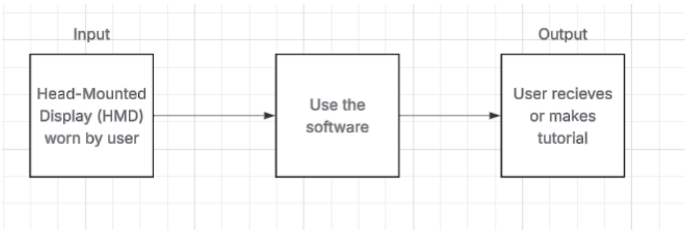
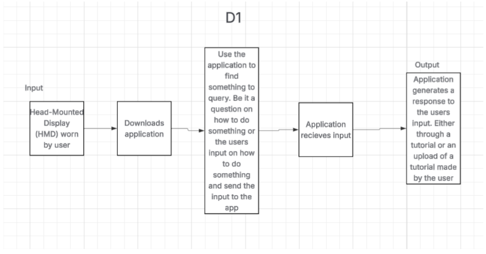
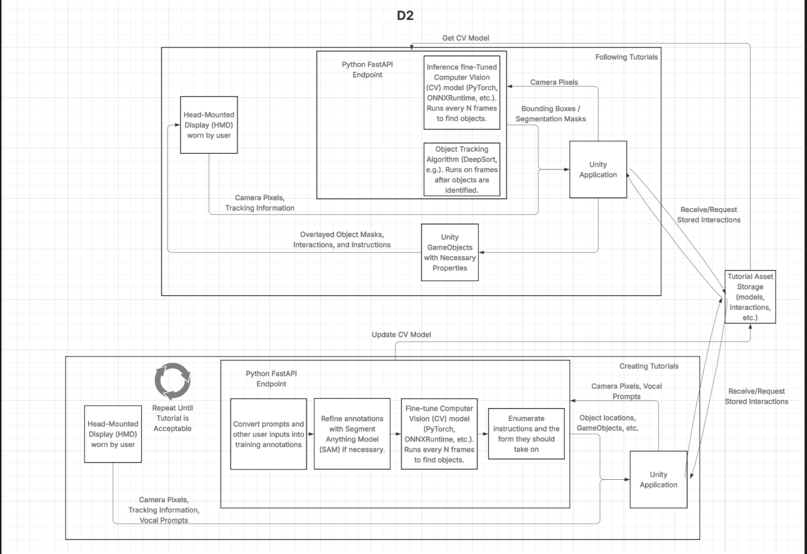

Conventions: Boxes are for descriptors and arrows are for the chain of events. 

Diagram 0: The highest-level view of the design. The basic components include the inputs from the user themselves and HMD, the software on the device, and the expected output from the device. 

Diagram 1: This is a middle level look into the overall design of the project. The diagram shows the user will need to download the application on their respective device. The user will need to input into the headset a question or a statement for the application to then turn that question into a tutorial or the statement into an upload to teach others. 

Diagram 2: This diagram dives deep into the specific implementation decisions we have made to arrive at the intended final product. It shows how on the tutorial-following side, the HMD pulls camera pixel values and tracking information, enabling the trained computer vision model to perform inference, the tracking algorithm to update instances as they/the user move, and Unity to bring this together to overlay interactions and identifiers. For the tutorial-creation side, it shows the HMD pulling this same information, plus vocal prompts from the user. From there, the underlying CV model is fine-tuned to detect relevant objects as called out by the user, either by voice commands or text/cursor entries. Lastly, interaction overlays and the Unity GameObjects that represent them are generated and stored. Unlike with following a tutorial, the creation process is iterative, in that the user can perform it multiple times, each slightly different, introducing to the models variety and thus robustness to users’ likely different environments. 

 