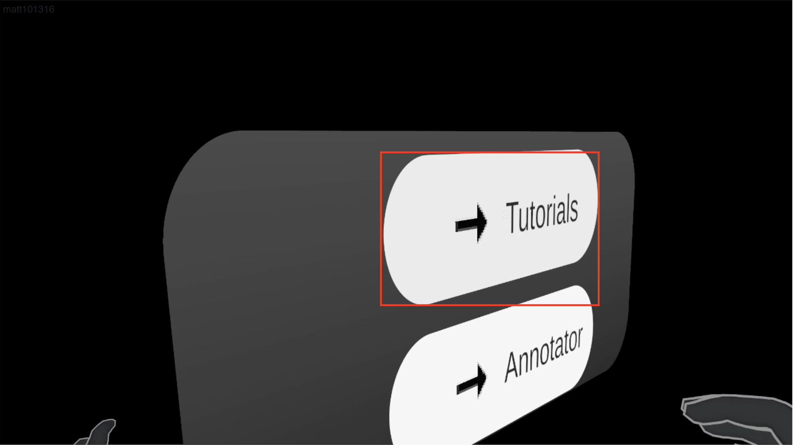

# Realtorial User Docs

### Overview
Realtorial is a product for visualizing and following through tutorials that adapt to the real world. It utilizes advanced computer vision capabilties to find the objects you need and convey the interactions and steps needed to complete a task.

### Hardware Requirements
Realtorial is currently designed to run on Meta [Quest 3](https://www.meta.com/quest/quest-3/)  and [Quest 3s](https://www.meta.com/quest/quest-3s/) HMDs.

Controllers are not necessary for following tutorials (hand-tracking is used here), but are for creating them.

### Steps to Use
1. Don one of the [approved headsets](#hardware-requirements).
2. Acquire the Realtorial software package.
3. Launch the Realtorial application from the HMD's App Library.
4. Point to the button labeled "Tutorials" and select it by pinching.

5. From the next screen, select the name of the tutorial you'd like to perform and press "Go".
6. Follow the steps by performing the [interactions](#interaction-description) on the specified objects, pressing "Next" after completing each one.
7. Once the task is complete, click the "Finish" button to return to the Main Menu.

### Interaction Description
"Interactions" is the name used for interacting with objects to follow a tutorial. Below we highlight a few common interactions you may see while following a tutorial.

#### Grab
Grab interactions consist of grabbing an object and holding it. It is a step that is followed by other interactions where an object needs to be moved, rotated, or otherwise manipulated.

#### Translate
Translations are the process of moving one object to another location, usually that of another object.

#### Rotate
Rotations are when an object needs to be oriented in a certain way.

#### Press
A press is when an object such as a button needs to be pressed.

#### Look
Looks are constantly used to prompt you of where in the scene to look for object(s).

### FAQs
Q: Can you create tutorials for others to use?

A: While this capability is not currently supported, we intend to add it in the future!

Q: How accurate is Realtorial's object detection/tracking?

A: Realtorial relies on industry-proven [YOLO](https://www.ultralytics.com/) for object detection/tracking. While a quantitative measure is not available, we use the most modern, highest-performing version of YOLO.

Q: How long can I use Realtorial without needing to charge it.

A: While we do not have a quantitative measure of operation time while using Realtorial, the high-energy consumption of the underlying systems suggests that around an hour of use is a reasonable estimate.
